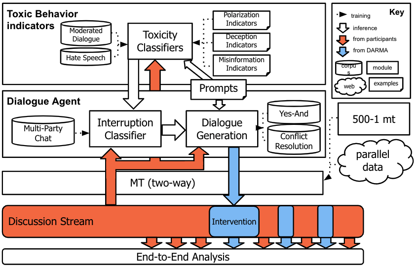

# DARMA ISI 

[](https://opensource.org/licenses/MIT)

### Overview 

This is the repository for **DARMA**: _**D**ialogue **A**gent for **R**educing **M**alicious **A**cts_, a team from the [Information Sciences Institute](https://isi.edu), [University of Southern California](https://usc.edu) for the [AIE Civil Sanctuary](https://govtribe.com/opportunity/federal-contract-opportunity/civil-sanctuary-darpapa210401) project. 

DARMA is currently set up with 4 main modular components: 
1. _Translator_: necessary for making DARMA applicable for all languages
2. _Moderation classifier_: any triggers that assist moderation strategy 
3. _Moderation strategy_: based on triggers from the moderation classifier, determine the moderation strategy
4. _Response generator_: generate responses to be used for moderation 



### Set up 

1. `git clone git@github.com:wise-east/isi_darma.git`
1. `conda create -n darma python=3.7`
2. `cd isi_darma` 
3. `pip install -r requirements.txt`
4. `pip install -e . ` 
5. `export CRED_FP="<your path to creds.yaml file>"`

**Important**: 
Step 5 is important for being able to use the reddit client. Refer to the [reddit client section](#reddit-api)

### DARMA Bot

You can find a basic implementation of DARMA bot in `src/basic_bot.py`. 
By executing `python src/basic_bot.py` and keeping it running, you will be running a bot that responds to all comments, except for its own, in the subreddit `r/darma_test`. It is currently set up to respond to all existing comments using [SpolinBot](https://spolin.isi.edu) without keeping track of which ones it already responded to. It has the following flow for the time being: 
1. Detect language of incoming comment
2. Translate comment to English 
3. Determine whether moderation is needed. 
4. If needed, determine the moderation strategy 
5. If moderation strategy is to respond, generate a response. 
6. Translate generated response back to source language. 


### Contributing

First, clone this repo and then create your own branch. 

```
git checkout -b <your branch name>
<make code updates>
git add . 
git commit -m '<your updates>'
```

Before making any code changes, make sure to regularly check whether there have been updates to the `main` branch and keep your code up to date. 

```
git checkout main # checkout to the main branch 
git pull origin main # make sure that your main branch is up to date
git checkout <your branch> # checkout to your branch
git rebase main # make sure that your branch is building on top of all the updates in the main branch 
```

You may have to resolve conflicts on merging with the last command. it might not be desirable to merge yet if there are conflicts, so if in doubt, please ask. 

After making updates, make sure to first rebase with the `main` branch before you make any pushes and pull requests. Follow the same steps as above. 


### Reddit API 

To use the Reddit API, you need the following parameters: 
```
reddit = praw.Reddit(
    user_agent="",
    client_id="",
    client_secret="", 
    username="", 
    password=""
)
```

- `user_agent` can be anything, but the recommended format is `<platform>:<app ID>:<version string> (by u/<Reddit username>)`
- You can find the `client_id`, `client_secret` in https://www.reddit.com/prefs/apps/. 
- The username and password is the reddit account's username and password. 
- All the relevant information is loaded from a `creds.yaml` file. Ask Justin for this file if you would like to test with darma bot or provide your own credentials to test your own bot. 
- `creds.yaml` file should have the format: 

```
username: 
password: 
client_secret: 
client_id: 
```

### References

Here are the list of references used for developing this bot. 
1. [How To Make A Reddit Bot?](https://yojji.io/blog/how-to-make-a-reddit-bot)
2. https://www.reddit.com/r/redditdev/comments/fj06x8/comment_reply_bot_using_praw/
3. https://github.com/toddrob99/MLB-StatBot/blob/master/statbot/main.py
4. [Reddit Moderator Guide](https://www.reddit.com/r/modguide/wiki/index#wiki_modguide_index)
5. [Bobby-b-bot](https://github.com/bobby-b-bot/reddit/blob/master/reddit_bot.py): easiest code base to use as starting point for bot that replies to comments. 


## License 

MIT License